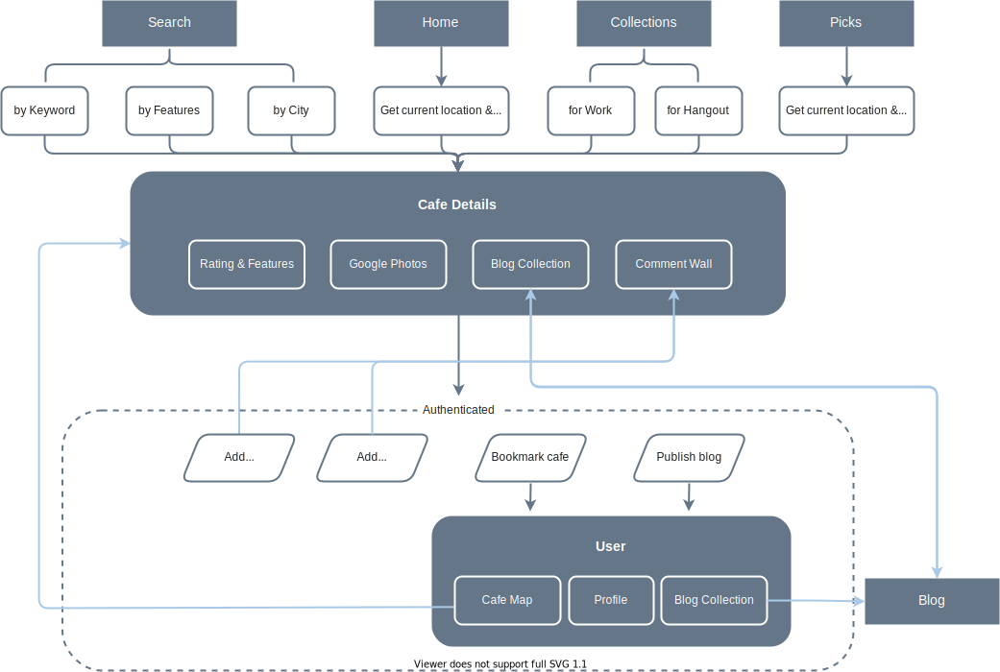
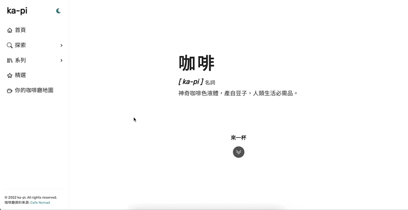
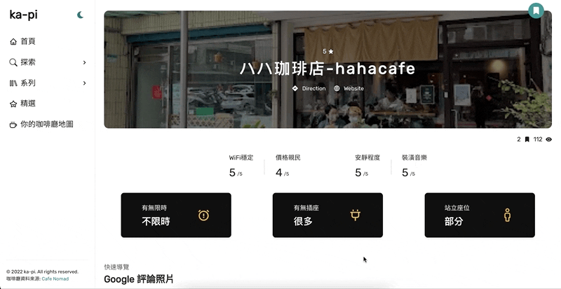
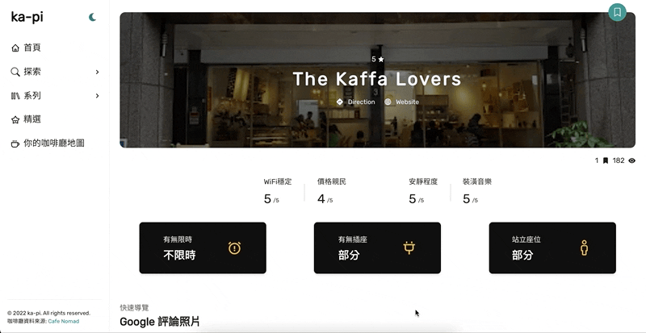

> #### Online cafe finder - find cafes with ease.
>
> ⚡ Fun fact: `ka-pi` means coffee in Taiwanese.

## Motivation

Searching for a cafe that good for working, which has sockets, no time limitation and so on, usually takes a bunch of time. The goal of ka-pi is to make the process easier.

## Intro

- Obtain user's current location and list out cafes nearby(Taiwan).
- Search cafes by keyword, features or city.
- Allow user to bookmark cafes and create their own cafe maps.
- Publish cafe blog to share the experience.
- Leave a comment to connect with the community.

## Try It Now

Get me a cuppa ☕️ : **[ka-pi](https://ka-pi-7c760.web.app)**

##### <em>Note: For full experiences, please allow location access and sign in.</em>

## Built with ☕️ and

- Front-End Fundamental
  - HTML / CSS / JavaScript
  - Responsive Web Design (RWD)
- Libraries
  - React (Hooks)
  - React Router
  - prop-types
- Back-End Framework & Cloud Services
  - Node.js / Express.js
  - Firebase
    - Authentication
    - Firestore
    - Storage
    - Hosting
  - Heroku
- Packages
  - leaflet
  - react-leaflet
  - react-icons
  - draft-js
  - formik
  - yup
  - chakra-ui/react
  - choc-ui
  - emoji-picker-react
- Other
  - Tool: Prettier
  - Version Control: Git / GitHub

## Flow Chart

## Features

#### `Bookmark a cafe and create your own cafe map`

#### `Search cafes`

Search cafes in multiple ways.

- Search by keyword
  

- Search by features
  

- Search by city
  

#### `Publish a blog`

Edit & publish your experience with others. 

#### `Leave comment or reply`

Start a conversation with other cafe lovers. 

#### `Update user profile`

Update profile, remove cafes from the bookmarked list or delete outdated blogs. 

#### `Dark mode & RWD`

Browse ka-pi in dark mode from any device. 

## Contact

If you have any suggestion, feel free to reach out.

Ellen Chen / chialin76@gmail.com
